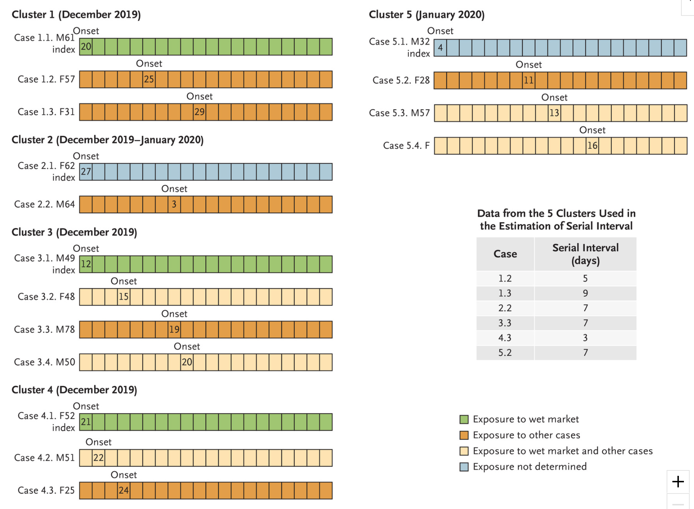

```{r setup, include=FALSE}
version <- "1.8"
version_date <- lubridate::ymd("2020-02-28")

knitr::opts_chunk$set(echo = FALSE, cache=TRUE,
                      tidy.opts=list(width.cutoff=60),
                      tidy=TRUE)

library(tidyverse)
library(magrittr)
library(lubridate)
library(tibble)
library(ggplot2)
library(ggthemes)
library(hrbrthemes)
library(rvest)
library(gt)
library(deSolve)
library(EpiEstim)
library(incidence)
library(distcrete)
library(epitrix)
library(projections)
```

# Pre-amble

This article is the first of several that have been distilled from [a much longer document](https://cbdrh.github.io/NovelCoronavirus/on-COVID-19.html) which started as a late-Friday-afternoon, curiosity-driven exploration of COVID-19 data and the `R` tools and packages that might be used to analyse them. Work on that document rapidly expanded to occupy much of the very wet Sydney weekend of 8th & 9th February 2020, with a view to using it as a teaching resource for both UNSW Medicine undergraduate and postgraduate courses -- in particular the MSc in Health Data Science offered by the [Centre for Big Data Research in Health](https://cbdrh.med.unsw.edu.au).

Please note that neither this post nor the parent document have been peer-reviewed, and that I claim no particular expertise in modelling communicable disease outbreaks, although I have been involved in outbreak preparedness work a decade ago, including [establishing surveillance systems and developing case-contact tracking systems](https://www.publish.csiro.au/nb/nb09046) for the public health response to the 2009 influenza A/H1N1 "swine flu" pandemic while working at the NSW Ministry (previously Department) of Health.

Please also note that this post **only uses data for Chinese cases up to 15th February 2020**, and thus it cannot be considered a **situation report** reflecting the latest available data. The reason for truncating data at 15th February is due to major changes the case definitions used by the authorities in Hubei province from that date forward, which add additional complications to the modelling presented here. 

The full code is available from the GitHub repository linked at the foot of this post.

# The local situation

Since this post is being written in Sydney, New South Wales (NSW), Australia,  we'll start by looking at the work of NSW Health, which is the umbrella name for the various public-sector health services and authorities in NSW. NSW Health has been issuing daily reports on its response to the 2019 novel coronavirus (2019-nCoV, henceforth referred to as COVID-19) outbreak, which look like this:


```{r, out.width="95%", out.extra='style="background-color: #9ecff7; padding:2px; display: inline-block;"', eval=TRUE, echo=FALSE, fig.cap="[Figure from a COVID-19 daily media release from NSW Health](https://www.health.nsw.gov.au/news/pages/2020-nsw-health.aspx)"}

knitr::include_graphics("assets/example_NSW_Health_media_release.png")
```

So let's collect the data from each of these media releases and visualise it as a time-series.^[I have updated the NSW Health data shown in this post since it was written and originally published. But the data for China still only covers the period up to 15th February.] Automated web-scraping was not used for these data because only a few data items need to be abstracted from each report, and the format of the daily reports evolved quite a lot -- sometimes it is easier to just capture the required data manually. 

We can do a bit of value-adding to the data by calculating daily counts of people screened, tested and cleared from the cumulative totals given in the NSW Health media releases, and merely presenting the data as time-series reveals information not obvious from the individual daily reports.  

```{r nsw_graph, message=FALSE, warning=FALSE, layout="l-body-outset", fig.width=10, fig.height=8}
nCoV_2019_nsw <- tribble(~dt,~Confirmed,~Investigating,~ClearedCumulative, ~Admitted, ~Discharged, ~ScreenedCumulative, ~TestedCumulative,~ChinaArrivals,~ChinaArrivalsTested,
                  dmy_hm("25-01-2020 17:00"), 0, 7, NA, NA, NA, NA, NA, NA, NA,
                  dmy_hm("26-01-2020 17:00"), 3, 1, NA, NA, NA, NA, NA, NA, NA,
                  dmy_hm("27-01-2020 12:00"), 4, 5, NA, NA, NA, NA, NA, NA, NA,
                  dmy_hm("28-01-2020 11:30"), 4, 6, NA, NA, NA, NA, NA, NA, NA,
                  dmy_hm("29-01-2020 10:00"), 4, 6, NA, NA, NA, NA, NA, NA, NA,
                  dmy_hm("30-01-2020 16:00"), 4, 20, 50, 2, 2, NA, NA, NA, NA,
                  dmy_hm("31-01-2020 10:30"), 4, 9, 67, 2, 2, NA, NA, NA, NA,
                  dmy_hm("01-02-2020 10:30"), 4, 12, 86, 1, 3, NA, NA, NA, NA,
                  dmy_hm("02-02-2020 12:00"), 4, 27, 101, 1, 3, NA, NA, NA, NA,
                  dmy_hm("03-02-2020 12:00"), 4, 24, 134, 1, 3, NA, NA, NA, NA,
                  dmy_hm("04-02-2020 12:00"), 4, 29, 170, 1, 3, NA, NA, NA, NA,
                  dmy_hm("05-02-2020 14:30"), 4, 35, 300, 1, 3, 3430, 11, NA, NA,
                  dmy_hm("06-02-2020 13:45"), 4, 28, 307, 1, 3, 7397, 39, 1672, 13,
                  dmy_hm("07-02-2020 09:30"), 4, 22, 371, 1, 3, 9163, 44, 1766, 5,
                  dmy_hm("08-02-2020 11:00"), 4, 22, 540, 1, 3, 10473, 50, 1310, 6,
                  dmy_hm("09-02-2020 09:30"), 4, 15, 614, 1, 3, 11924, 55, 1451, 5,
                  dmy_hm("10-02-2020 12:30"), 4, 22, 652, 1, 3, 14459, 57, 677, 1,
                  dmy_hm("11-02-2020 12:30"), 4, 18, 673, 1, 3, 15035, 61, 505, 4,
                  dmy_hm("12-02-2020 09:30"), 4, 54, 764, 1, 3, 15044, 61, 513, 4,
                  dmy_hm("13-02-2020 14:30"), 4, 14, 870, 0, 4, 16295, 63, 555, 0,
                  dmy_hm("14-02-2020 14:30"), 4, 61, 992, 0, 4, 16804, 64, 503, 1,
                  dmy_hm("16-02-2020 11:00"), 4, 13, 1175, 0, 4, 17093, 64, 263, 0,
                  dmy_hm("17-02-2020 14:30"), 4, 36, 1186, 0, 4, 17783, 65, 198, 1,
                  dmy_hm("18-02-2020 16:30"), 4, 159, 1242, 0, 4, 18096, 66, 290, 1,
                  dmy_hm("19-02-2020 14:30"), 4, 65, 1486, 0, 4, 18442, 66, 316, 0,
                  dmy_hm("20-02-2020 15:30"), 4, 45, 1657, 0, 4, 18995, 66, 498, 0,
                  dmy_hm("21-02-2020 14:30"), 4, 55, 1764, 0, 4, 19404, 66, 441, 0,
                  dmy_hm("22-02-2020 14:30"), 4, 155, 1828, 0, 4, 19708, 66, 293, 0,
                  dmy_hm("23-02-2020 14:30"), 4, 59, 1975, 0, 4, 20173, 66, 454, 0,
                  dmy_hm("24-02-2020 14:30"), 4, 65, 2009, 0, 4, 20385, 66, 204, 0,
                  dmy_hm("25-02-2020 14:30"), 4, 171, 2082, 0, 4, 20683, 67, 224, 1,
                  dmy_hm("26-02-2020 12:30"), 4, 213, 2267, 0, 4, 20835, 67, 142, 0
                  ) %>% 
                arrange(dt) %>%
                mutate(Screened = ScreenedCumulative - lag(ScreenedCumulative, default=0),
                       Cleared = ClearedCumulative - lag(ClearedCumulative, default=0),
                       Tested = TestedCumulative - lag(TestedCumulative, default=0)) %>%
                mutate(Screened = if_else(is.na(Screened) & !is.na(ScreenedCumulative),
                                          ScreenedCumulative, 
                                          Screened)) %>%
                mutate(Tested = if_else(is.na(Tested) & !is.na(TestedCumulative),
                                          TestedCumulative, 
                                          Tested)) %>%
                mutate(Cleared = if_else(is.na(Cleared) & !is.na(ClearedCumulative),
                                          ClearedCumulative, 
                                          Cleared)) %>%
                select(dt, Confirmed, Investigating, Cleared, ClearedCumulative, Admitted, Discharged,
                       Screened, ScreenedCumulative, Tested, TestedCumulative,
                       ChinaArrivals, ChinaArrivalsTested) %>%
                pivot_longer(Confirmed:ChinaArrivalsTested, names_to="status",
                             values_to="count") %>%
                mutate(status=factor(status, levels=c("Confirmed", 
                                                      "Admitted",
                                                      "Discharged",
                                                      "Investigating", 
                                                      "Cleared",
                                                      "ClearedCumulative", 
                                                      "Screened",
                                                      "ScreenedCumulative",
                                                      "Tested",
                                                      "TestedCumulative", 
                                                      "ChinaArrivals",
                                                      "ChinaArrivalsTested"),
                                             labels=c("Confirmed\n(cumulative)",
                                                      "Admitted\n(cumulative)",
                                                      "Discharged\n(cumulative)",
                                                      "Investigating\n(currently)", 
                                                      "Cleared\n(since last\n report)",
                                                      "Cleared\n(cumulative)",
                                                      "Screened\n(since last\n report)",
                                                      "Screened\n(cumulative)",
                                                      "Tested\n(since last\n report)",
                                                      "Tested\n(cumulative)",
                                                      "Arrivals from\nmainland\nChina\n(previous day)",
                                                      "China arrivals\n tested"),
                                             ordered=TRUE))

p <- nCoV_2019_nsw %>%
    filter(!status %in% c("Admitted\n(cumulative)", "Discharged\n(cumulative)"),
           dt <= version_date) %>%
    ggplot(aes(x=dt, y=count, colour=status)) + geom_point() + geom_line() +
    facet_grid(status~., scales = "free_y") + 
    labs(x="Date/time of media release", y="Persons", title="NSW Health COVID-19 statistics, 2020",
         caption = "Source: NSW Health media releases at https://www.health.nsw.gov.au/news/Pages/2020-nsw-health.aspx") + 
    scale_x_datetime(date_breaks="2 days", date_labels = "%d %b") +
    scale_y_continuous(limits = c(0, NA)) +
    # scale_colour_brewer(palette = "Set2") +
    theme_minimal() +
    theme(legend.position = "none", 
          strip.text.y = element_text(size=7),
          plot.caption = element_text(hjust = 0)) 
    
print(p)
```

The ensemble of time-series charts clearly show that the NSW public health control efforts, including intensive airport screening, voluntary isolation and, of course, travel restrictions^[From 1st February 2020, Australia banned entry of anyone travelling from or through mainland China, with the exception of returning Australian citizens and permanent residents. Some exceptions were made for a small number of secondary students. At the time of writing, the travel restrictions are still in place.], are working. 

Having been involved in the public health response to 2009 A/H1N1 swine flu pandemic, I know how much round-the-clock work is involved in mounting such a response. NSW Health should be praised for its efforts, which deserve a more informative presentation than the little table in the daily press release as shown above!

This admittedly parochial example is provided to illustrate the potential value of providing even simple visualisations and modest value-added analyses (such as merely differencing cumulative counts to yield daily counts) -- tasks that that health authorities personnel may not have the capacity to do themselves while simultaneously dealing with an epidemic.

# Modelling the COVID-19 epidemic in China

On 4th February [this blog post](https://blog.ephorie.de/epidemiology-how-contagious-is-novel-coronavirus-2019-ncov) by blogger _Learning Machines_ was featured on [R-bloggers](https://www.r-bloggers.com). It very nicely sets out how to use `R` to solve the three simultaneous differential equations which describe the classic SIR (Susceptible-Infectious-Recovered) compartmental model of communicable disease outbreaks (see [this wikipedia page](https://en.wikipedia.org/wiki/Compartmental_models_in_epidemiology) for an more thorough treatment of compartmental models), and the use one of the optimisers in base `R` to fit that SIR model to the observed COVID-19 incidence data by minimising the residual sum of squares. This lets us estimate the basic reproduction number $R_{0}$ and be able to make (possibly naïve) predictions about the epidemic. The blog post used data for all of China, but given that Wuhan and other cities in Hubei province have effectively been partitioned from the rest of China since about 24th January, it makes sense to model the situation in Hubei only, so we'll repeat the oh-so-elegant model fitting process here.  But first we need some data, and of course we need to do an initial exploratory data analysis before we fit any models!

## Obtaining data 

Naturally we want our analysis to be reproducible, and that means avoiding all manual abstracting and transcribing of data (um, like the manual abstracting and transcribing of NSW Health data that I just did above...). Thus we will  programmatically acquire the relevant data from the web -- we want to be able to just re-run the program code and have analyses automatically update themselves. There are now many potential sources, but when I first started working on this analysis on 8th February, there were very few accessible, detailed and up-to-date sources of machine-readable data for COVID-19 incidence in China. [This wikipedia page](https://en.wikipedia.org/wiki/Timeline_of_the_2019–20_Wuhan_coronavirus_outbreak), which is currently being updated very promptly as new data is released, is a detailed and well-referenced source, and, being wikipedia, it is also versioned, and editable (indeed, I had to make a few edits to the tables on the wikipedia page we are scraping in order to make table parsing easier and more reliable). So, with (quite) a few lines of code, we can download and scrape the data contained in the relevant tables on that page that give counts of laboratory-confirmed cases, and deaths in confirmed cases, by day and by province, clean it up and have it ready to use in our analysis. Note that counts of clinically-confirmed cases (by lung CT) that were being reported by Hubei province for a while are not used in this analysis, so we will remove them from the data we acquire.

The alternative is laboriously visiting many different web sites and abstracting the data from text such as this:

```{r, out.width="95%", eval=TRUE, echo=FALSE, fig.cap="[Figure from Health Commission of Hubei](http://www.hubei.gov.cn/zhuanti/2020/gzxxgzbd/zxtb/)"}

knitr::include_graphics("assets/Hubei_Health_Commission_page.png")
```

Here is the code used to acquire data from wikipedia. Notice that the code references a specific version of the relevant wikipedia page. 

```{r get_china_data, message=FALSE, warning=FALSE, tidy=TRUE, echo=TRUE}
# download the wikipedia web page
# we use a specific version of the template page directly
# version of the wikipedia page that is used by this version of this document
wikipedia_data_url <- paste("https://en.wikipedia.org/w/index.php?title=Template:",
                            "2019–20_Wuhan_coronavirus_data/",
                            "China_medical_cases_by_province&oldid=941235662",
                            sep="")

outbreak_webpage <- read_html(wikipedia_data_url)

# parse the web page and extract the data from the first table 
provinces_confirmed <- outbreak_webpage %>%
                        html_nodes("table") %>%
                        .[[1]] %>%
                        html_table(fill = TRUE) %>%
                        rename(Date="Date (CST)")

# fix up the column names, get rid of footnotes and other non-data
# and convert columns to appropriate data types.
excl_hubei <- provinces_confirmed %>% select(starts_with("ExcludingHubei")) %>% pull(1)

hubei_sans_wuhan <- provinces_confirmed %>% 
                        select(starts_with("Hubei:")) %>%
                        select(-contains("clinical", ignore.case = TRUE)) %>% 
                        pull(1)

# utility function to remove commas in numbers as character strings
rm_commas <- function(x) gsub(",", "", x)

provinces_confirmed <- provinces_confirmed %>%
                        select(-starts_with("ExcludingHubei")) %>%
                        select(-starts_with("Hubei:")) %>%
                        rename(Wuhan="Wuhan,Hubei",
                               National="National(confirmed)") %>%
                        mutate(NationalSansHubei=excl_hubei,
                               HubeiSansWuhan=hubei_sans_wuhan,
                               Date=ymd(Date),
                               National=stringr::str_split(National, "\\[", simplify=TRUE)[,1],
                               Hubei=stringr::str_split(Hubei, "\\[", simplify=TRUE)[,1],
                               Wuhan=stringr::str_split(Wuhan, "\\[", simplify=TRUE)[,1]
                               ) %>%
                        select(-contains("clinical", ignore.case = TRUE)) %>%
                        select(-contains("inclusive", ignore.case = TRUE)) %>%
                        filter(!is.na(Date)) %>%
                        mutate_if(is.character, rm_commas) %>%
                        mutate_if(is.character, as.integer) 

# work out the order for the columns from the data, descending order
provinces_confirmed %>% 
    pivot_longer(-Date, names_to="province",
                 values_to="incident_cases") %>%
    group_by(province) %>%
    summarise(total=sum(incident_cases, na.rm=TRUE)) %>%
    arrange(desc(total)) %>%
    pull(province) -> province_order

# re-arrange the columns in the dataset and fill in some 
# missing values, but not all, with zeroes.
# Also, lab-confirmed and clinical counts for Wuhan are combined on the
# source Hubei health Commission from 15 Feb so
# set to NA since we cannot split out the lab-confirmed only
provinces_confirmed <- provinces_confirmed %>%
    select(c('Date',province_order)) %>%
    arrange(Date) %>%
    mutate(National=ifelse(is.na(National), 0, National),
           Hubei=ifelse(is.na(Hubei), 0, Hubei),
           Wuhan=ifelse(is.na(Wuhan), 0, Wuhan)) %>%
    mutate(Wuhan=ifelse(Date >= ymd("2020-02-15"), NA, Wuhan),
           HubeiSansWuhan=ifelse(Date >= ymd("2020-02-15"), NA, HubeiSansWuhan))

# repeat for deaths
# parse the web page and extract the data from the second table 
provinces_deaths <- outbreak_webpage %>%
                        html_nodes("table") %>%
                        .[[2]] %>%
                        html_table(fill = TRUE) %>%
                        rename(Date="Date (CST)")

# fix up the column names, get rid of footnotes and other non-data
# and convert columns to appropriate data types.
hubei_sans_wuhan <- provinces_deaths %>% 
                      select(starts_with("Hubei:")) %>%
                      select(-contains("clinical", ignore.case = TRUE)) %>% 
                      pull(1)

provinces_deaths <- provinces_deaths %>%
                        select(-starts_with("Hubei:")) %>%
                        rename(Wuhan="Wuhan,Hubei",
                               National="National(confirmed)") %>%
                        mutate(
                               HubeiSansWuhan=hubei_sans_wuhan,
                               Date=ymd(Date),
                               National=stringr::str_split(National, "\\[", simplify=TRUE)[,1],
                               Hubei=stringr::str_split(Hubei, "\\[", simplify=TRUE)[,1],
                               Wuhan=stringr::str_split(Wuhan, "\\[", simplify=TRUE)[,1]
                               ) %>%
                        select(-contains("clinical", ignore.case = TRUE)) %>%
                        select(-contains("inclusive", ignore.case = TRUE)) %>%
                        filter(!is.na(Date)) %>%
                        mutate_if(is.character, rm_commas) %>%
                        mutate_if(is.character, as.integer) %>%
                        mutate(NationalSansHubei = National - Hubei)


# work out the order for the columns from the data, descending order
provinces_deaths %>% 
    pivot_longer(-Date, names_to="province",
                 values_to="deaths_in_confirmed_cases") %>%
    group_by(province) %>%
    summarise(total=sum(deaths_in_confirmed_cases, na.rm=TRUE)) %>%
    arrange(desc(total)) %>%
    pull(province) -> province_order_deaths

# re-arrange the columns in the dataset and fill in some 
# missing values, but not all, with zeroes
# Also, lab-confirmed and clinical deaths for Wuhan are combined on the
# source Hubei health Commission from 15 Feb so
# set to NA since we cannot split out the deaths in lab-confirmed cases only
provinces_deaths <- provinces_deaths %>%
    select(c('Date',province_order_deaths)) %>%
    arrange(Date) %>%
    mutate(National=ifelse(is.na(National), 0, National),
           Hubei=ifelse(is.na(Hubei), 0, Hubei),
           Wuhan=ifelse(is.na(Wuhan), 0, Wuhan))  %>%
    mutate(Wuhan=ifelse(Date >= ymd("2020-02-15"), NA, Wuhan),
           HubeiSansWuhan=ifelse(Date >= ymd("2020-02-15"), NA, HubeiSansWuhan))

# there are still issues with death counts in lab-confirmed after 12th Feb.
# in particular the national count is less than tha Hubei count.
# So we will just truncate the deaths at 12th Feb.
provinces_deaths <- provinces_deaths %>%
    filter(Date <= ymd("2020-02-12"))
```

Yes, that's all a bit fiddly, and the code requires constant maintenance as the format of the source tables are changed by wikipedia editors, often in arbitrary ways. In the next section, we will compare the wikipedia source to a widely-used source provided by Johns Hopkins University in the US. Why doesn't the WHO have a nice API for obtaining all these data, I hear you ask? That's what humankind deserves. Anyway, in the meantime, thank goodness for wikipedia and its tireless contributors and editors, and thanks to the Johns Hopkins University team maintaining their version of the data. But I can't help but feel that there ought to be a well-resourced, canonical source for these data, with a nice RESTful API.

In the interests of brevity, we won't display the scraped incidence and deaths data in a table here, but doing so would be good practice.^[The [full version of this analysis](https://cbdrh.github.io/NovelCoronavirus/on-COVID-19.html) uses the excellent `gt` library to display such tables for those who are interested.]

```{r china_incidence_table, message=FALSE, warning=FALSE, tidy=TRUE, echo=FALSE, include=FALSE}
# now present these data as a table
# define a function for the grand total row
fns_labels <- list(Total = ~sum(., na.rm = TRUE))

# specify how many provinces to show in the table
num_provs <- 15

# create the table using the gt package
provinces_confirmed %>%
    mutate(onset_date=format(Date, "%d %b %Y")) %>%
    arrange(Date) %>%
    select(c('onset_date',province_order[1:num_provs])) %>%
    gt(rowname_col = "onset_date") %>%
    fmt_number(columns=1:num_provs, decimals = 0) %>%
    grand_summary_rows(fns = fns_labels, decimals=0) %>%
    tab_header(title="Laboratory-confirmed Chinese cases of COVID-19, national and by province", 
               subtitle = "(only provinces with the greatest numbers of cases shown, scroll horizontally)") %>%
    tab_source_note(
      source_note = md("Source: [Timeline of the 2019–20 Wuhan coronavirus outbreak]( https://en.wikipedia.org/wiki/Timeline_of_the_2019–20_Wuhan_coronavirus_outbreak)"))
```

```{r china_deaths_table, message=FALSE, warning=FALSE, tidy=TRUE, echo=FALSE, include=FALSE}
# now present these data as a table
# define a function for the grand total row
fns_labels <- list(Total = ~sum(., na.rm = TRUE))

# specify how many provinces to show in the table
num_provs <- 15

# create the table using the gt package
provinces_deaths %>%
    mutate(death_date=format(Date, "%d %b %Y")) %>%
    arrange(Date) %>%
    select(c('death_date',province_order_deaths[1:num_provs])) %>%
    gt(rowname_col = "death_date") %>%
    fmt_number(columns=1:num_provs, decimals = 0) %>%
    grand_summary_rows(fns = fns_labels, decimals=0) %>%
    tab_header(title="Deaths in laboratory-confirmed Chinese cases of COVID-19, national and by province", 
               subtitle = "(only provinces with the greatest numbers of cases shown, scroll horizontally)") %>%
    tab_source_note(
      source_note = md("Source: [Timeline of the 2019–20 Wuhan coronavirus outbreak]( https://en.wikipedia.org/wiki/Timeline_of_the_2019–20_Wuhan_coronavirus_outbreak)"))
```

## Checking the data

Wikipedia is _crowd-sourced_, and anyone can edit the pages at any time, although incorrect information is usually corrected very rapidly by a community of editors and contributors, at least for active pages of interest. That is certainly the case for the wikipedia pages on COVID-19 incidence and deaths data we are using in this analysis. Nonetheless, it is **always** a good idea to check sources wherever possible. 

In fact, there is [another source of similar, collated COVID-19 data](https://github.com/CSSEGISandData/COVID-19), maintained by Johns Hopkins University Center for Systems Science and Engineering (JHU CCSE) and used as the source for [the dashboard](https://gisanddata.maps.arcgis.com/apps/opsdashboard/index.html#/bda7594740fd40299423467b48e9ecf6) which they provide.

So let's download that data and compare it to the data we are scraping from wikipedia. We are using a cached copy of [this revision](https://github.com/CSSEGISandData/COVID-19/blob/5a0760fcfee8f698cff0251b6e578385153f396e/csse_covid_19_data/csse_covid_19_time_series/time_series_19-covid-Confirmed.csv) of the data as it was at 15:18 2002-02-18 AEDT (Australia/Sydney timezone). Note that timezones are taken into account as far as possible: the JHU data is supposed to be the data as at 23:59hrs UTC for each day, whereas the wikipedia data are just described as “Date (CST)“, where CST is presumed to be China Standard Time, which is the same as Beijing time.

```{r JHU_incidence, message=FALSE, warning=FALSE, tidy=TRUE, fig.height=10, fig.asp=2, echo=TRUE}
destfile="./assets/provinces_confirmed_jh.rda" 
if (!file.exists(destfile)) {
  provinces_confirmed_jh <- read_csv("https://raw.githubusercontent.com/CSSEGISandData/COVID-19/master/csse_covid_19_data/csse_covid_19_time_series/time_series_19-covid-Confirmed.csv") %>%
    rename(province="Province/State",
           country_region="Country/Region") %>%
    pivot_longer(-c(province, country_region, Lat, Long), 
                 names_to = "Date",
                 values_to="cumulative_cases") %>%
    mutate(Date=as.Date(mdy_hm(paste(Date, "23:59", tz="UTC")), tz="China/Beijing")) %>%
    filter(country_region == "Mainland China") %>%
    group_by(province) %>%
    arrange(province, Date) %>%
    group_by(province) %>%
    mutate(incident_cases = c(0,diff(cumulative_cases))) %>%
    ungroup() %>%
    select(-c(country_region, Lat, Long, cumulative_cases)) %>%
    pivot_wider(Date, names_from = province,
                values_from=incident_cases) %>%
    rename(InnerMongolia="Inner Mongolia") %>%
    mutate(source="Johns Hopkins University")
    save(provinces_confirmed_jh, file=destfile)
} else {
    load(destfile)
}

compare_provinces_confirmed <- provinces_confirmed %>%
                                mutate(source="wikipedia") %>%
                                select(c(Date, source, names(provinces_confirmed_jh))) %>%
                                bind_rows(provinces_confirmed_jh) %>%
                                arrange(Date, desc(source)) %>%
                                select(Date, source, everything())

compare_provinces_confirmed %>%
  filter(Date <= ymd("2020-02-12")) %>%
  pivot_longer(-c(Date, source), 
               names_to="province",
               values_to="incident_cases") %>%
  filter(province %in% c("Hubei",	"Beijing", "Guangdong",
                         "Henan",	"Zhejiang",	"Hunan",	"Anhui",
                         "Jiangxi",	"Jiangsu",	"Chongqing",	
                         "Shandong")) -> compare_provinces_confirmed_long

compare_provinces_confirmed_long %>%
  bind_rows(compare_provinces_confirmed_long %>%
              group_by(Date, source) %>%
              summarise(incident_cases = sum(incident_cases, na.rm = TRUE)) %>%
              mutate(province = "Sum all provinces")) %>%
  ggplot(aes(x=Date, y=incident_cases, colour=source)) +
    geom_line() +
    geom_point() +
    facet_grid(province~., scale="free_y") +
    labs(y="Daily incident confirmed cases",
         title="Comparison of wikipedia and Johns Hopkins University\nCOVID-19 daily incidence data up to 12th February, 2020.",
         subtitle="(Note: not all provinces shown here)",
         caption="Sources: Johns Hopkins CSSE Novel coronavirus COVID-19 (2019-nCoV) data repository\nat https://github.com/CSSEGISandData/COVID-19\nwikipedia: https://en.wikipedia.org/wiki/Timeline_of_the_2019–20_Wuhan_coronavirus_outbreak") +
    theme(legend.position="top", legend.title = element_blank())
```

There is clearly a lag of 1 day between the two sources for many, but not all of the provinces. That isn't a major concern and won't change any of our analyses very much. Of much greater concern are the large differences for specific days, for the provinces with substantial numbers of cases. The most egregious difference between the JHU and wikipedia incidence data is for Hubei province on 2nd February 2020, for which the JHU data gives 4024 new cases, and the wikipedia data gives 2103 new cases. Note that that was well before the change in case definition for Hubei province, which occured on 12th February. The relevant source document for Hubei province for 2nd February is [here](http://wjw.hubei.gov.cn/fbjd/dtyw/202002/t20200203_2018272.shtml), and using Google Translate on the contents of that page reveals that the wikipedia data are, in fact, correct.

Let's check that against another authorative source. Table 2 in the [WHO Sitrep (Situational Report) for 1st February 2020](https://www.who.int/docs/default-source/coronaviruse/situation-reports/20200201-sitrep-12-ncov.pdf?sfvrsn=273c5d35_2) gives the cumulative count of confirmed COVID-19 cases in Hubei province as 7153. Table 1 in the [WHO SitRep for 2nd February 2020](https://www.who.int/docs/default-source/coronaviruse/situation-reports/20200202-sitrep-13-ncov-v3.pdf?sfvrsn=195f4010_6) gives the cumulative count of confirmed COVID-19 cases in Hubei province as 9074. The difference is `r 9074 - 7153`, which is much closer to figure given for the same date by the Hubei provincial government web site of 2103 cases than it is to the corresponding JHU data of 4024 cases. The minor difference between the WHO and the Hubei government site may perhaps be due to differing cut-off times for daily tallies of case counts.   

That's enough checking for the puposes of this analysis, but it underlines the importance of checking the accuracy of web data sources, even apparently reputable ones.

## Exploratory data analysis

Every analysis should start with a thorough EDA. The code for all this is just standard `tidyverse` fair, and is available in the GitHib repository for this post, via the link at foot of this post.

### Daily cumulative incidence

First, let's look at the daily cumulative number of incident, lab-confirmed cases for Wuhan city, for Hubei province (which contains Wuhan), for all the other provinces combined, and for all of China. 

```{r cumulative_incidence, message=FALSE, warning=FALSE, tidy=TRUE, fig.width=10, fig.height=10}
provinces_confirmed %>%
    pivot_longer(-Date, names_to="province",
                 values_to="incident_cases") %>%
  filter(province %in% c("Wuhan", "HubeiSansWuhan", "Hubei", "NationalSansHubei", "National")) %>%
  mutate(province=ordered(province, levels=c("Wuhan", "HubeiSansWuhan", "Hubei", "NationalSansHubei", "National"),
                          labels=c("Wuhan", "Hubei - Wuhan", "Hubei", "Other provinces", "All of China"))) -> daily_incidence

cumulative_incidence <- daily_incidence %>%
  group_by(province) %>%
  arrange(Date) %>%
  tidyr::replace_na(list(incident_cases = 0)) %>%
  mutate(cumulative_incident_cases=cumsum(incident_cases)) %>%
  mutate(cumulative_incident_cases = ifelse(cumulative_incident_cases == 0,
                                            NA,
                                            cumulative_incident_cases)) %>%
  # truncate Wuhan and Hubei sans Wuhan data after 14th Feb because confirmed counts
  # not longer available
  mutate(cumulative_incident_cases=ifelse(Date >= ymd("2020-02-15") & 
                                            province %in% c("Wuhan", 
                                                            "Hubei - Wuhan"),
                                          NA, cumulative_incident_cases))

cumulative_incidence %>%
  ggplot(aes(x=Date, y=cumulative_incident_cases)) + geom_point() + geom_line() +
    scale_x_date(date_breaks="7 days", date_labels = "%d %b") +
    facet_grid(province ~., scales="free_y") + labs(y="Daily cumulative incidence",
                                   title="Lab-confirmed cases of COVID-19 in China, 2020",
                                   caption="Note: varying y-axis scales") +
  theme(legend.position = "none", 
          strip.text.y = element_text(size=11))
```

The initial increases for Wuhan and the balance of Hubei, and for all of China look to be approximately exponential, as is expected for epidemic spread. Let's plot them on a logarithmic _y_ axis. We would expect to see a linear increase on a log scale if the epidemic curve is indeed exponential.

```{r log_cumulative_incidence, message=FALSE, warning=FALSE, tidy=TRUE, fig.width=10, fig.height=10}
cumulative_incidence %>%
  ggplot(aes(x=Date, y=cumulative_incident_cases)) + geom_point() + geom_line() +
    scale_y_log10() +
    scale_x_date(date_breaks="7 days", date_labels = "%d %b") +
    facet_grid(province ~., scales="free_y") + labs(y="Daily cumulative incidence (log scale)",
                                   title="Lab-confirmed cases of COVID-19 in China, 2020",
                                   caption="Note: varying y-axis scales") +
    theme(legend.position = "none", 
          strip.text.y = element_text(size=11))
```

One could convince oneself that log-linearity is present.

### Daily incremental incidence

Let's also look at the daily incremental incidence. This is more informative, and is known in outbreak epidemiological parlance as the _epidemic curve_. It is traditionally visualised as a bar chart, which emphasises missing data more than a line chart, even one with points as well. We'll adhere to epidemiological tradition.

```{r daily_incidence, message=FALSE, warning=FALSE, tidy=TRUE, fig.width=10, fig.height=10}
daily_incidence %>%
  ggplot(aes(x=Date, y=incident_cases))  + # geom_point() + geom_line() +
    geom_bar(stat="identity") + 
    scale_x_date(date_breaks="7 days", date_labels = "%d %b") +
    facet_grid(province ~., scales="free_y") + labs(y="Daily incremental incidence",
                                   title="Lab-confirmed cases of COVID-19 in China",
                                   caption="Note: varying y-axis scales")  +
    theme(legend.position = "none", 
          strip.text.y = element_text(size=11))
```

At the time of writing (17th February), it looks like incidence has plateaued and is now beginning to decline in Wuhan,  and that daily incremental incidence is very definitely falling everywhere else in mainland China.

### Epidemic curves for all provinces, plus Wuhan city

Finally, let's quickly visualise the epidemic curves for all the provinces (plus Wuhan city).

```{r all_provinces_incidence, message=FALSE, warning=FALSE, tidy=TRUE, fig.height=16, fig.width=10}
p <- provinces_confirmed %>%
    pivot_longer(-Date, names_to="province",
                 values_to="incident_cases") %>%
  filter(!province %in% c("National")) %>%
  ggplot(aes(x=Date, y=incident_cases)) + # geom_point() + geom_line() +
    geom_bar(stat="identity") + 
    facet_wrap(province ~., scales = "free_y", ncol=3) + labs(y="Daily incremental incidence",
                                   title="Lab-confirmed cases of COVID-19 in China, 2020",
                                   subtitle="Note: differing y-axis scales") +
    theme(legend.position = "none", 
          strip.text.y = element_text(size=7))
print(p)
```

And let's look at the cumulative incidence, with all provinces on the same scale to put things in perspective.

```{r all_provinces_cum_incidence, message=FALSE, warning=FALSE, tidy=TRUE, fig.height=16, fig.width=10}
daily_incidence_all_provs <- provinces_confirmed %>%
    pivot_longer(-Date, names_to="province",
                 values_to="incident_cases") %>%
  filter(!province %in% c("National"))

cumulative_incidence_all_provs <- daily_incidence_all_provs %>%
  group_by(province) %>%
  arrange(Date) %>%
  tidyr::replace_na(list(incident_cases = 0)) %>%
  mutate(cumulative_incident_cases=cumsum(incident_cases)) %>%
  mutate(cumulative_incident_cases = ifelse(cumulative_incident_cases == 0,
                                            NA,
                                            cumulative_incident_cases)) 

cumulative_incidence_all_provs %>%
  ggplot(aes(x=Date, y=cumulative_incident_cases)) + # geom_point() + geom_line() +
    geom_bar(stat="identity") + 
    facet_wrap(province ~., ncol=3) + labs(y="Daily cumulative incidence",
                                   title="Lab-confirmed cases of COVID-19 in China, 2020")  +
    theme(legend.position = "none", 
          strip.text.y = element_text(size=7))
```

It is clear that Wuhan is not only the epicentre of the outbreak, but that it continues to be the main location of new infections.

### Daily cumulative and incremental deaths in lab-confirmed cases

Now let's look the daily (incremental) number of deaths in lab-confirmed cases for Wuhan city, for Hubei province (which contains Wuhan), for all the other provinces combined, and for all of China. 

```{r cumulative_deaths, message=FALSE, warning=FALSE, tidy=TRUE, fig.width=10, fig.height=10}
provinces_deaths %>%
    pivot_longer(-Date, names_to="province",
                 values_to="deaths_in_confirmed_cases") %>%
  filter(province %in% c("Wuhan", "HubeiSansWuhan", "Hubei", "NationalSansHubei", "National")) %>%
  mutate(province=ordered(province, levels=c("Wuhan", "HubeiSansWuhan", "Hubei", "NationalSansHubei", "National"),
                          labels=c("Wuhan", "Hubei - Wuhan", "Hubei", "Other provinces", "All of China"))) -> daily_deaths

cumulative_deaths <- daily_deaths %>%
  group_by(province) %>%
  arrange(Date) %>%
  tidyr::replace_na(list(deaths_in_confirmed_cases = 0)) %>%
  mutate(cumulative_deaths_in_confirmed_cases=cumsum(deaths_in_confirmed_cases)) %>%
  #mutate(cumulative_deaths_in_confirmed_cases = ifelse(deaths_in_confirmed_cases == 0,
  #                                          NA,
  #                                          deaths_in_confirmed_cases)) %>%
  # truncate Wuhan and Hubei sans Wuhan data after 14th Feb because confirmed counts
  # not longer available
  mutate(cumulative_deaths_in_confirmed_cases=ifelse(Date >= ymd("2020-02-15") & 
                                            province %in% c("Wuhan", 
                                                            "Hubei - Wuhan"),
                                          NA, cumulative_deaths_in_confirmed_cases))

cumulative_deaths %>%
  ggplot(aes(x=Date, y=cumulative_deaths_in_confirmed_cases)) + # geom_point() + geom_line() +
    geom_bar(stat="identity") + 
    facet_grid(province ~., scales="free_y") + labs(y="Daily cumulative deaths",
                                   title="Cumulative deaths in lab-confirmed cases of COVID-19 in China",
                                   caption="Note: varying y-axis scales") +
  theme(legend.position = "none", 
          strip.text.y = element_text(size=11))
```

Let's also look at the daily incremental deaths in lab-confirmed cases.

```{r daily_deaths_plot, message=FALSE, warning=FALSE, tidy=TRUE, fig.width=10, fig.height=10}
daily_deaths %>%
  ggplot(aes(x=Date, y=deaths_in_confirmed_cases)) + # geom_point() + geom_line() +
    geom_bar(stat="identity") + 
    facet_grid(province ~., scales="free_y") + labs(y="Daily incremental deaths",
                                   title="Daily deaths in lab-confirmed cases of COVID-19 in China",
                                   caption="Note: varying y-axis scales")  +
    theme(legend.position = "none", 
          strip.text.y = element_text(size=11))
```

### Incidence and deaths

Finally, let's also look at the number of daily incremental lab-confirmed incident cases and the daily incremental deaths in lab-confirmed cases, aligned by date.

```{r daily_case_deaths_plot, message=FALSE, warning=FALSE, tidy=TRUE,fig.width=10, fig.height=8}
daily_incidence %>%
  filter(province %in% c("Hubei", "All of China")) %>%
  mutate(series="Lab-confirmed cases",
         count=incident_cases) %>%
  select(Date, province, series, count) -> a

daily_deaths %>%
  filter(province %in% c("Hubei", "All of China")) %>%
  mutate(series="Deaths in lab-confirmed cases",
         count=deaths_in_confirmed_cases) %>%
  select(Date, province, series, count) -> b

a %>%
  bind_rows(b) %>%
  ggplot(aes(x=Date, y=count)) + # geom_point() + geom_line() +
    geom_bar(stat="identity") + 
    facet_grid(series~province, scales="free_y") + labs(y="Daily incremental count",
                                   title="Daily cases and deaths in Hubei province and all of China",
                                   caption="Note: varying y-axis scales")  +
    theme(legend.position = "none", 
          strip.text = element_text(size=11))
```

Clearly daily counts of deaths are continuing to rise despite the fact that the daily count of new cases is now falling. This is not surprising, given that it takes some time for cases to either recover or to die, and therefore the trend in deaths will necessarily lag behind any trend in daily incidence.

# Fitting an SIR model to the Hubei province data

On 4 February 2020, data science blogger _Learning Machines_ posted [this analysis](https://blog.ephorie.de/epidemiology-how-contagious-is-novel-coronavirus-2019-ncov) of the COVID-19 outbreak, in which he fitted the classic SIR (Susceptible-Infectious-Recovered) model to the incidence data for all of China. His explanation of how to fit this model using _R_ is so nice, I'll reproduce it here, with a few tweaks.

The basic idea behind the SIR model of communicable disease outbreaks is that there are three groups (also called _compartments_) of people: those who are healthy but susceptible to the disease $S$, the infectious (and thus, infected) $I$ and people who have recovered $R$:


To model the dynamics of the outbreak we need three differential equations, to describe the rates of change in each group, parameterised by $\beta$ which controls the transition between $S$ and $I$ and $\gamma$ which controls the transition between $I$ and $R$:

$$\frac{dS}{dt} = - \frac{\beta I S}{N}$$

$$\frac{dI}{dt} = \frac{\beta I S}{N}- \gamma I$$

$$\frac{dR}{dt} = \gamma I$$

The first step is to express these differential equations as an _R_ function, which is easier than one might think -- the expressions in the code are just direct translations of the differential equations, with respect to time $t$ of course.

```{r SIR_function, echo=TRUE}
SIR <- function(time, state, parameters) {
  par <- as.list(c(state, parameters))
  with(par, {
    dS <- -beta * I * S / N
    dI <- beta * I * S / N - gamma * I
    dR <- gamma * I
    list(c(dS, dI, dR))
    })
}
```

To fit the model to the data we need two things: a solver for these differential equations and an optimiser to find the optimal values for our two unknown parameters, $\beta$ and $\gamma$. The function `ode()` (for _ordinary differential equations_) from the `deSolve` package for `R` makes solving the system of equations easy, and to find the optimal values for the parameters we wish to estimate, we can just use the `optim` function built into base _R_. Specifically what we need to do is minimise the sum of the squared differences between $I(t)$, which is the number of people in the infectious compartment $I$ at time $t$, and the corresponding number of cases as predicted by our model $\hat{I}(t)$. This quantity is known as the _residual sum of squares_ (RSS)^[It is also possible to fit SIR and related models by MLE.].

$$RSS(\beta, \gamma) = \sum_{t} \left( I(t)-\hat{I}(t) \right)^2$$

Rather than fit a model to the incidence data for all of China, let's fit a model to the incidence data for Hubei province only, given that Hubei contains Wuhan, the city which is the source of the outbreak. Most cities in Hubei have been isolated from the rest of China since 23rd January, so it makes sense to model Hubei separately. We need a value $N$ for the initial uninfected population. Once again we'll scrape population data from a suitable wikipedia page. See the repository for the code.

```{r get_china_pops, message=FALSE, warning=FALSE, tidy=TRUE}
china_pops_webpage <- read_html("https://en.wikipedia.org/wiki/List_of_Chinese_administrative_divisions_by_population")
china_pops <- china_pops_webpage %>% 
            html_nodes("table") %>%
            .[[4]] %>% 
            html_table(fill = TRUE) %>%
            rename(province="Administrative Division",
                   pop2017="2017",
                   urban2017="Urban (2017)",
                   rural2017="Rural (2017)") %>%
            select(province, pop2017, urban2017, rural2017) %>%
            mutate(pop2017=as.numeric(gsub(",", "", pop2017)),
                   urban2017=as.numeric(gsub(",", "", urban2017)),
                   rural2017=as.numeric(gsub(",", "", rural2017)))

N <- china_pops %>%
        filter(province == "Hubei") %>%
        pull(pop2017)

# let's get populations for Wuhan as well
wuhan_pops_webpage <- read_html("https://www.macrotrends.net/cities/20712/wuhan/population")
wuhan_pops <- wuhan_pops_webpage %>% 
            html_nodes("table") %>%
            .[[2]] %>% 
            html_table(fill = TRUE, header=FALSE) %>%
            rename(year=X1, population=X2) %>%
            mutate(population=rm_commas(population)) %>%
            mutate_if(is.character, as.integer) %>%
            filter(!is.na(year)) %>%
            select(-X3)

N_wuhan <- wuhan_pops %>%
        filter(year==2020) %>%
        pull(population)

```

The approximate population of Hubei province in 2017 was `r format(N, big.mark=",")` people, according to [this wikipedia page](https://en.wikipedia.org/wiki/List_of_Chinese_administrative_divisions_by_population). 

Next, we need to create a vector with the daily cumulative incidence for Hubei, from 15th January when our daily incidence data starts, through to 30th January. We'll then compare the predicted incidence from the SIR model fitted to these data with the actual incidence since 30th January. We also need to initialise the values for $S$, $I$ and $R$. 

```{r incidence_vector, tidy=TRUE, echo=TRUE}
# put the daily cumulative incidence numbers for Hubei from 
# 15th Jan to 30th Jan into a vector called Infected
sir_start_date <- "2020-01-15"

Infected <- cumulative_incidence %>%
              filter(province == "Hubei",
                     Date >= ymd("2020-01-15"),
                     Date <= ymd("2020-01-30")) %>%
              pull(cumulative_incident_cases)

# Create an incrementing Day vector the same length as our cases vector
Day <- 1:(length(Infected))

# now specify initial values for S, I and R
init <- c(S = N-Infected[1], I = Infected[1], R = 0)
```

Then we need to define a function to calculate the $RSS$, given a set of values for $\beta$ and $\gamma$.

```{r define_RSS_function, tidy=TRUE, echo=TRUE}
# define a function to calculate the residual sum of squares (RSS),
# passing in parameters beta and gamma that are to be optimised for the
# best fit to the incidence data
RSS <- function(parameters) {
  names(parameters) <- c("beta", "gamma")
  out <- ode(y = init, times = Day, func = SIR, parms = parameters)
  fit <- out[ , 3]
  sum((Infected - fit)^2)
}
```

Finally, we can fit the SIR model to our data by finding the values for $\beta$ and $\gamma$ that minimise the residual sum of squares between the observed cumulative incidence and the predicted cumulative incidence. We also need to check that our model has converged, as indicated by the message shown below:

```{r fit_SIR_model, tidy=TRUE, echo=TRUE}
# now find the values of beta and gamma that give the smallest RSS,
# which represents the best fit to the data. Start with values of 0.5 for each,
# and constrain them to the interval 0 to 1.0
Opt <- optim(c(0.5, 0.5), RSS, 
             method = "L-BFGS-B", 
             lower = c(0, 0), upper = c(1, 1)) 

# check for convergence
Opt$message
```

Convergence is confirmed. Now we can examine the fitted values for $\beta$ and $\gamma$.

```{r SIR_model_fit_examine, echo=TRUE}
Opt_par <- setNames(Opt$par, c("beta", "gamma"))
Opt_par
```

Those values don't mean a lot, _per se_, but let's use them to get the fitted numbers of people in each compartment of our SIR model for the dates up to 30th January that were used to fit the model, and compare those fitted values with the observed data.

```{r SIR_model_plot_fitted_data, echo=TRUE, tidy=TRUE, message=FALSE}
# time in days for predictions
t <- 1:as.integer(today() - ymd(sir_start_date)) 
# get the fitted values from our SIR model
fitted_cumulative_incidence <- data.frame(ode(y = init, times = t, 
                                              func = SIR, parms = Opt_par))
# add a Date column and join the observed incidence data
fitted_cumulative_incidence <- fitted_cumulative_incidence %>%
    mutate(Date=ymd(sir_start_date) + days(t-1),
           province="Hubei") %>%
    left_join(cumulative_incidence %>% 
                ungroup() %>%
                filter(province=="Hubei") %>%
                select(Date, cumulative_incident_cases))

# plot the data
fitted_cumulative_incidence %>%
    filter(Date <= ymd("2020-01-30")) %>%
    ggplot(aes(x=Date)) + geom_line(aes(y=I), colour="red") +
              geom_point(aes(y=cumulative_incident_cases), colour="orange") +
              labs(y="Cumulative incidence", 
                   title="COVID-19 fitted vs observed cumulative incidence, Hubei province",
                   subtitle="(red=fitted incidence from SIR model, orange=observed incidence)")
```

That looks like a reasonably good fit to the observed cumulative incidence data, so we can now use our fitted model to calculate the  _basic reproduction number_ $R_{0}$ which gives the average number of susceptible people who are infected by each infectious person:

$$R_{0} = \frac{\beta}{\gamma}$$

That's very easy to calculate, and we get:

```{r SIR_model_R0, echo=FALSE, tidy=TRUE}
R0 <- setNames(Opt_par["beta"] / Opt_par["gamma"], "R0")
R0
```

An $R_{0}$ of 2.0 is consistent the values calculated by others for COVID-19, and is also consistent with the $R_{0}$ for SARS and MERS, which are similar diseases also cause by _coronavirus_.

## Using the SIR model for Hubei province to make predictions

An obvious next step is to use our fitted SIR model to make predictions about the future course of the outbreak. However, caution is required, because the SIR model assumes a fixed _reproduction number_, but if public health interventions have been implemented, such as quarantining of cases, contact tracing and isolation of those contacts, and general restrictions on social mixing, such as closing the city of Wuhan, then the _effective reproduction number_ $R_{e}$ will be dynamic and should fall as those interventions are progressively implemented, to values considerably less than the _basic reproduction number_ $R_{0}$, which reflects the behaviour of the virus at the beginning of an epidemic before any response has been implemented.

So let's use our SIR model, fitted to the first 15 days of data, to extrapolate out to the current date, and compare that against the observed values:

```{r SIR_model_plot_extrapolated, echo=FALSE, tidy=TRUE, message=FALSE, warning=FALSE}
fitted_cumulative_incidence %>%
    ggplot(aes(x=Date)) + geom_line(aes(y=I), colour="red") +
              geom_point(aes(y=cumulative_incident_cases), colour="orange") +
              scale_y_continuous(labels = scales::comma) +
              labs(y="Cumulative incidence", 
                   title="COVID-19 fitted vs observed cumulative incidence, Hubei province",
                   subtitle="(red=fitted incidence from SIR model, orange=observed incidence)")
```

We can see that the actual incidence is much lower than that predicted by our model. The reason is that, due to the swift and decisive public health interventions implemented by the Chinese authorities, the $R_{e}$ of the COVID-19 in Hubei province has already been substantially reduced. When the $R_{e}$ falls below 1.0, the peak of the epidemic (at least in Hubei) will have been reached and the outbreak will eventually die out.

## Using our model to let the outbreak "run its course" without intervention

It is instructive to use our model fitted to the first 15 days of available data on lab-confirmed cases in Hubei province, to see what would happen if the outbreak were left to run its course, without public health interventions.

```{r SIR_model_plot_no_intervention, echo=TRUE, tidy=TRUE, message=FALSE, warning=FALSE}
# time in days for predictions
t <- 1:70
# get the fitted values from our SIR model
fitted_cumulative_incidence <- data.frame(ode(y = init, times = t, 
                                              func = SIR, parms = Opt_par))
# add a Date column and join the observed incidence data
fitted_cumulative_incidence <- fitted_cumulative_incidence %>%
    mutate(Date=ymd(sir_start_date) + days(t-1),
           province="Hubei") %>%
    left_join(cumulative_incidence %>% 
                ungroup() %>%
                filter(province=="Hubei") %>%
                select(Date, cumulative_incident_cases))

# plot the data
fitted_cumulative_incidence %>%
    ggplot(aes(x=Date)) + geom_line(aes(y=I), colour="red") +
              geom_line(aes(y=S), colour="black") +
              geom_line(aes(y=R), colour="green") +
              geom_point(aes(y=cumulative_incident_cases), colour="orange") +
              scale_y_continuous(labels = scales::comma) +
              labs(y="Persons", 
                   title="COVID-19 fitted vs observed cumulative incidence, Hubei province") +
              scale_colour_manual(name = '', 
         values =c('red'='red', 'black'='black', 'green'='green', 'orange'='orange'), 
         labels = c('Susceptible', 'Recovered', 'Observed incidence', 'Infectious'))
```

It is easier to see what is going on if we use a log scale:

```{r SIR_model_plot_no_intervention_log, echo=FALSE, tidy=TRUE, message=FALSE, warning=FALSE}
# plot the data
fitted_cumulative_incidence %>%
    ggplot(aes(x=Date)) + geom_line(aes(y=I, colour="red")) +
              geom_line(aes(y=S, colour="black")) +
              geom_line(aes(y=R, colour="green")) +
              geom_point(aes(y=cumulative_incident_cases, colour="orange")) +
              scale_y_log10(labels = scales::comma) +
              labs(y="Persons", 
                   title="COVID-19 fitted vs observed cumulative incidence, Hubei province") + 
              scale_colour_manual(name = '', 
         values =c('red'='red', 'black'='black', 'green'='green', 'orange'='orange'), 
         labels = c('Susceptible', 'Recovered', 'Observed incidence', 'Infectious'))
```

Clearly that prediction, should it come to pass, would be an unmitigated disaster. At this point, it is worth remarking on the importance of decisive public health intervention to limit the spread of such epidemics. Without such interventions, tens of millions of people could be infected, as our model predicts, and even with only a one or two per cent mortality rate, hundreds of thousands of people would die. The economic and human cost of the outbreak control steps taken within China are large, but the alternatives are a lot worse!

## Ascertainment rates

So far, we have assumed that the counts of lab-confirmed cases represent all the cases that are infectious. This is unlikely to be true -- typically only a proportion of actual cases are detected or found or sent for testing. This proportion is known as the _ascertainment rate_. The ascertainment rate is likely to change during the course of an outbreak, particularly if surveillance and screening efforts are increased, or if case definitions are changed. Such changing ascertainment rates can be easily incorporated into our model by using a set of weights, or a weighting function, for our incidence data, but for the sake of simplicity, let's see what happens if we assume a fixed ascertainment rate of 20%^[In a very interesting paper, [Nishiura _et al_.](https://doi.org/10.3390/jcm9020419) state: "_There were two interesting features of the evacuation process conducted by Japanese authorities. First, all 565 passengers [repatriated to Japan from Wuhan] were screened for symptoms upon arrival. Prior to disembarkation, the quarantine officers used portable thermoscanners to screen the temperature. In the following, all passengers were interviewed regarding whether they have any symptoms suggestive of upper respiratory tract infection, including fever and cough. Of the 565 passengers, 63 were symptomatic. Second, the passengers were tested for presence of 2019‐nCoV using reverse transcription polymerase chain reaction (RT‐PCR), and eight passengers (1.4%) were determined to have the virus. Importantly, most of the individuals positive for the virus were asymptomatic (five passengers), while only the other three had symptoms consistent with 2019‐nCoV infection, indicating that the dataset generated from this process can help investigate the full spectrum of infection including mild and asymptomatic infections._". Thus, they found about 60% of those infected with the COVID-19 virus were essentially asymptomatic, and thus likely to be undetected and unascertained.]. If we apply that, thus inflating the number of incident cases by a factor of 5, and refit our model, we get the following results.

```{r SIR_with_ascertianment_rate, tidy=TRUE}
# put the daily cumulative incidence numbers for Hubei from 
# 15th Jan to 30th Jan into a vector called Infected
sir_start_date <- "2020-01-15"

Infected <- cumulative_incidence %>%
              filter(province == "Hubei",
                     Date >= ymd("2020-01-15"),
                     Date <= ymd("2020-01-30")) %>%
              pull(cumulative_incident_cases)

# Apply a fixed 20% ascertainment rate

Infected <- Infected * 5

# Create an incrementing Day vector the same length as our cases vector
Day <- 1:(length(Infected))

# now specify initial values for S, I and R
init <- c(S = N-Infected[1], I = Infected[1], R = 0)

RSS <- function(parameters) {
  names(parameters) <- c("beta", "gamma")
  out <- ode(y = init, times = Day, func = SIR, parms = parameters)
  fit <- out[ , 3]
  sum((Infected - fit)^2)
}

Opt <- optim(c(0.5, 0.5), RSS, 
             method = "L-BFGS-B", 
             lower = c(0, 0), upper = c(1, 1)) 

# check for convergence
Opt$message

Opt_par <- setNames(Opt$par, c("beta", "gamma"))
Opt_par

R0 <- setNames(Opt_par["beta"] / Opt_par["gamma"], "R0")
R0
```

Note that these fitted parameters are the same as the ones we got above, without an ascertainment rate adjustment. Let's look at the fitted values.

```{r SIR_model_plot_no_intervention_ascertainment_adjustment, tidy=TRUE, message=FALSE, warning=FALSE}

# time in days for predictions
t <- 1:70
# get the fitted values from our SIR model
fitted_cumulative_incidence <- data.frame(ode(y = init, times = t, 
                                              func = SIR, parms = Opt_par))
# add a Date column and join the observed incidence data
fitted_cumulative_incidence <- fitted_cumulative_incidence %>%
    mutate(Date=ymd(sir_start_date) + days(t-1),
           province="Hubei") %>%
    left_join(cumulative_incidence %>% 
                ungroup() %>%
                filter(province=="Hubei") %>%
                select(Date, cumulative_incident_cases))

# plot the data
fitted_cumulative_incidence %>%
    ggplot(aes(x=Date)) + geom_line(aes(y=I), colour="red") +
              geom_line(aes(y=S), colour="black") +
              geom_line(aes(y=R), colour="green") +
              geom_point(aes(y=cumulative_incident_cases*5), colour="orange") +
              scale_y_log10(labels = scales::comma) +
              labs(y="Persons", 
                   title="COVID-19 fitted vs observed cumulative incidence adjusted for 20% ascertainment, Hubei province") +
              scale_colour_manual(name = '', 
         values =c('red'='red', 'black'='black', 'green'='green', 'orange'='orange'), 
         labels = c('Susceptible', 'Recovered', 'Observed incidence', 'Infectious'))
```

Perhaps counter-intuitively, incorporation of a fixed 20% ascertainment rate adjustment into our model makes little difference to the modelled outbreak if it is let run its course, except that it all happens a bit more quickly. But the number of infections remains the same, and the _basic reproduction number_ is unchanged. Note that that is for a fixed ascertainment rate. If the ascertainment rate varies significantly over time, then the parameter estimates will necessarily be biased -- but in the early days of an outbreak, it may be reasonable to assume that ascertainment rates don't change too much.

### More sophisticated models

We can also fit more sophisticated models which may better reflect real-life transmission processes. The SEIR model is widely used. As before, **S** stands for **Susceptible**, but **E** stand for **Exposed/infected but asymptomatic**, **I** stands for **Infected and symptomatic**, and **R** stands for **Recovered**. 

In a closed population (that is, assuming no births or deaths), the SEIR model is:

$$
\begin{aligned}
\frac{dS}{dt} & = -\frac{\beta IS}{N}\\
\\
\frac{dE}{dt} & = \frac{\beta IS}{N} - \kappa E\\
\\
\frac{dI}{dt} & = \kappa E - \gamma I\\
\\
\frac{dR}{dt} & = \gamma I
\end{aligned}
$$

Fitting this model to the observed data is left as an exercise for the reader. Note however, that these are _continuous-time_ dynamic models that assume fixed transition rates. There are other, stochastic models that use micro-simulation of individuals and allow for varying transition rates depending on attributes of individuals, social networking and so on. We will explore the utilty of such models in a later post.

# Modelling the epidemic trajectory using log-linear models

As noted above, the initial exponential phase of an outbreak, when shown in a semi-log plot (the y-axis with a logarithmic transform), appears (somewhat) linear. This suggests that we can model epidemic growth, and decay, using a simple log-linear model of the form:

$$log(y) = rt + b$$

where $y$ is the incidence, $r$ is the growth rate, $t$ is the number of days since a specific point in time (typically the start of the outbreak), and $b$ is the intercept. Separate models are fitted to the growth and the decay parts of the epidemic (incidence data) curve.

The `incidence` package for R, part of the excellent [**R** **E**pidemics **Con**sortium (**RECON**) suite](https://www.repidemicsconsortium.org) of packages for epidemic modelling and control, makes the fitting of such models very convenient (although it is not difficult using base R capabilities). We'll use that package to fit such a model. We need to convert daily case counts back into one case per row format first. The `uncount()` function the the `tidyr` package is perfect for doing that. 

```{r incidence_object, echo=TRUE, tidy=TRUE, message=FALSE}
# create a vector of dates, in character form, one for each case in Hubei province on each date
# using the uncount() function.
hubei_incidence_function_data <- provinces_confirmed %>%
                          filter(Date >= ymd("2020-01-11")) %>%
                          mutate(HubeiSansWuhan = ifelse(is.na(HubeiSansWuhan), 0, HubeiSansWuhan)) %>%
                          mutate(incident_cases=ifelse(Date < ymd("2020-02-15"), 
                                                       Wuhan + HubeiSansWuhan, 
                                                       Hubei)) %>%
                          mutate(Date=format(Date, "%Y-%m-%d")) %>%
                          select(Date, incident_cases) %>%
                          uncount(incident_cases)

hubei_incidence_object <- incidence(hubei_incidence_function_data$Date)
```

We can then find the date of peak incidence and indicate that on a plot of the daily incidence data. The `find_peak()` function in the `incidence` library does that for us (but it is also easy to do by eye or with some simple code, and there is also a more sophisticated peak detection function provided in the `incidence` library, but its use is unnecessary here.).

```{r plot_incidence_object, echo=TRUE, tidy=TRUE, message=FALSE}
hubei_incidence_peak <- find_peak(hubei_incidence_object)

plot(hubei_incidence_object) + 
  geom_vline(xintercept = hubei_incidence_peak, col = "red", lty = 2) +
  labs(title="Daily incidence of lab-confirmed cases, Hubei province",
       subtitle = "(red line indicates date of peak incidence)")
```

Now we can use the `fit()` function to fit two log-linear models, one to the growth phase before the peak, and one to the decay phase after the peak. We can plot the fitted values from our models (with confidence limits) on top of the actual observed incidence data for Hubei province.

```{r fit_incidence_object, echo=TRUE, tidy=TRUE, message=FALSE, warning=FALSE, preview=TRUE}
hubei_incidence_fit <- incidence::fit(hubei_incidence_object,
                                      split=hubei_incidence_peak)

# plot the incidence data and the model fit
plot(hubei_incidence_object) %>% 
  add_incidence_fit(hubei_incidence_fit) +
  labs(title="Observed and modelled incidence of COVID-19 cases",
       subtitle="Hubei province, 2020")
```


From the model, we can extract various parameters of interest: the **growth rate prior to the peak was `r format(incidence::get_info(hubei_incidence_fit, "r")[1],digits=2,nsmall=2)`** (95% CI `r format(incidence::get_info(hubei_incidence_fit, "r.conf")[1,1],digits=2,nsmall=2)` - `r format(incidence::get_info(hubei_incidence_fit, "r.conf")[1,2],digits=2,nsmall=2)`), and the **decay rate after the peak was `r format(incidence::get_info(hubei_incidence_fit, "r")[2],digits=2,nsmall=2)`** (95% CI `r format(incidence::get_info(hubei_incidence_fit, "r.conf")[2,2],digits=3,nsmall=2)` - `r format(incidence::get_info(hubei_incidence_fit, "r.conf")[2,1],digits=3,nsmall=2)`).

These growth and decay rates are equivalent to a **doubling time of `r format(incidence::get_info(hubei_incidence_fit, "doubling")[1],digits=1,nsmall=1)` days** (95% CI `r format(incidence::get_info(hubei_incidence_fit, "doubling.conf")[1],digits=1,nsmall=1)` - `r format(incidence::get_info(hubei_incidence_fit, "doubling.conf")[2],digits=1,nsmall=1)` days), and a **halving time of `r format(incidence::get_info(hubei_incidence_fit, "halving")[1],digits=1,nsmall=1)` days** (95% CI `r format(incidence::get_info(hubei_incidence_fit, "halving.conf")[1],digits=1,nsmall=1)` - `r format(incidence::get_info(hubei_incidence_fit, "halving.conf")[2],digits=1,nsmall=1)` days). 

The doubling and halving time estimates are very handy for informing public health intervention policy, which we will discuss in the conclusion. 

## Estimating the reproduction number from log-linear models

We can also use these log-linear models of the epidemic trajectory to estimate the reproduction number in the growth and decay phases of the epidemic. We need to provide a distribution for the _serial interval_ time, which is the time between the onset of a primary case and the time of onset in its secondary cases. We'll use a mean of 7.5 days and a standard deviation of 3.4 days to parameterise a discrete gamma distribution for the serial interval. See the discussion in next section of _serial intervals_ for justification of these values. The `distcrete` and `epitrix` libraries from the **RECON** suite of tools are needed to carry out the calculations. Here is a histogram of our calculated distribution of possible values for $R_{0}$ for the growth phase, based on the log-linear model we fitted to the Hubei incidence data:

```{r est_R0_growth, echo=TRUE, tidy=TRUE, message=FALSE, warning=FALSE}
mu <- 7.5 # days
sigma <- 3.4 # days
param <- gamma_mucv2shapescale(mu, sigma / mu)

w <- distcrete("gamma", interval = 1,
                 shape = param$shape,
                 scale = param$scale, w = 0)

growth_R0 <- lm2R0_sample(hubei_incidence_fit$before$model, w)
hist(growth_R0, col = "grey", border = "white", main = "Distribution of R0")
summary(growth_R0)
```

Note that the central estimates for $R_{0}$ are considerably higher than those we calculated with a SIR model fitted to the same Hubei province data, and are also higher than $R_{0}$ estimates published elsewhere, but they are consistent with estimates of the instantaneous effective reproduction number $R_{e}$ which we calculate in the next section^[They are also consistent with unpublished estimates of $R_{0}$ for the COVID-19 virus being discussed in various expert WHO fora, or so I am told by a reliable source who does not wish to be named.]. 

Here is the estimated $R_{e}$ for the decay phase:

```{r est_R0_decay, echo=TRUE, tidy=TRUE, message=FALSE, warning=FALSE}
decay_R0 <- lm2R0_sample(hubei_incidence_fit$after$model, w)
hist(decay_R0, col = "grey", border = "white", main = "Distribution of R0")
summary(decay_R0)
```

Unsurprisingly, it is well below 1.0 -- otherwise the epidemic would not be decaying, as we observe.

# Estimating changes in the _effective reproduction number_

Given the above, it would be useful to estimate the current _effective reproduction number_ $R_{e}$ on a day-by-day basis so as to track the effectiveness of public health interventions, and possibly predict at the earliest opportunity when an outbreak will turn the corner. Is that possible?

In fact, there are several available methods for estimating $R_{e}$ -- exploring all of those is beyond the scope of this post. Instead, we will focus on one method, developed in 2013 by Anne Cori and colleagues at Imperial College, London, which permits estimation of the _instantaneous effective reproduction number_, which is exactly want we want in order to track the effectiveness of containment efforts. Full details are available in the [original paper](https://www.ncbi.nlm.nih.gov/pmc/articles/PMC3816335/) on the method, with extensions described in a later paper by [Thompson _et al._](https://doi.org/10.1016/j.epidem.2019.100356). We'll use the `EpiEstim` package for _R_, which implements this method, with recent extensions to permit modelling of imported cases as well as local transmission. "Imported" my be from other species, and/or due to inbound human travel from other geographical regions.  

Once again, we'll start with the counts of lab-confirmed cases from in Hubei province and Wuhan city from 11th January 2020 onwards. We'll treat the initial 41 cases as "imported", possibly from a different species at the Wuhan fish markets. In fact, that assumption makes little difference to the estimates.

```{r Cori_model_get_data_hubei, echo=FALSE, tidy=TRUE, message=FALSE}
hubei_confirmed_cases <- provinces_confirmed %>%
                          filter(Date >= ymd("2020-01-11")) %>%
                          mutate(HubeiSansWuhan = ifelse(is.na(HubeiSansWuhan), 0, HubeiSansWuhan)) %>%
                          mutate(Hubei=ifelse(Date < ymd("2020-02-15"), Wuhan + HubeiSansWuhan, Hubei)) %>%
                          mutate(imported=ifelse(Date == ymd("2020-01-11"), Hubei, 0),
                                 local=ifelse(Date == ymd("2020-01-11"), 0, Hubei)) %>%
                          select(Date, local, imported) %>%
                          rename(dates=Date)

```

A critical parameter for the Cori model is the _serial interval_ (SI). The SI is the time between onset of symptoms of each case of the disease in question, and the onset of symptoms in any secondary cases that result from transmission from the primary cases. In other words, it is the time between cases in the (branching) chain of transmission of the disease. A moment's reflection reveals that the SI is, in fact, a statistical distribution of serial interval times, rather than a fixed value. That distribution can be simulated, typically using a discrete _gamma_ distribution with a given mean and standard deviation. 

The `estimate_R()` function in the `EpiEstim` package allows the SI distribution to be specified parametrically. It also allows uncertainty to be incorporated into the parameterisation of this distribution, and it even allows the SI distribution to be estimated empirically, using Bayesian methods, from individual line-listings of cases. We'll examine all of those capabilities.

At the time of writing, I was able to find only one published estimate of the _serial interval_ distribution, derived from analysis of just 5 primary cases amongst the first 450 cases in Wuhan, published by [Li _et al._](https://www.nejm.org/doi/full/10.1056/NEJMoa2001316). They estimate the serial interval distribution to have a mean of 7.5 days with a standard deviation of 3.4 days. This is almost identical to the  _serial interval_ parameters for the MERS virus, which were a mean of 7.6 and a SD of 3.4. This similarity is not surprising given that both pathogens are _coronavirii_. Let's use that to estimate the instantaneous $R_{e}$ for Hubei province.

```{r Cori_parametric_si_model_fit_hubei, echo=TRUE, tidy=TRUE, message=FALSE, warning=FALSE}
# custom results plotting function to avoid the ugly
# TableGrob messages returned by the plotting function
# in the EpiEstim package
plot_Ri <- function(estimate_R_obj) {
  p_I <- plot(estimate_R_obj, "incid", add_imported_cases=TRUE) # plots the incidence
  p_SI <- plot(estimate_R_obj, "SI") # plots the serial interval distribution
  p_Ri <- plot(estimate_R_obj, "R")
  return(gridExtra::grid.arrange(p_I, p_SI, p_Ri, ncol = 1))
}

hubei_res_parametric_si <- estimate_R(hubei_confirmed_cases,
                                      method="parametric_si",
                                      config = make_config(list(
                                                           mean_si = 7.5, 
                                                           std_si = 3.4)))

plot_Ri(hubei_res_parametric_si)
```

The first thing to note is that the slope of the _effective reproduction number_ curve is decidedly downwards, which strongly suggests that containment efforts are succeeding in progressively reducing transmission of the disease in Hubei province. That is encouraging.

The second thing to note is that the 7-day sliding window estimates of **instantaneous** $R_{e}$ are very high, approaching 10 at the peak. This seems unlikely. It is possible that the Cori model or its implementation as an `R` library is flawed, but it has been developed and implemented by the pre-eminent epidemic modelling team in the world, and has been shown to accurately estimate $R_{e}$ using a wide range of historical outbreak data. There are, however, a number of possible alternative explanations. 

One possible explanation is that COVID-19 is transmissible **before** the onset of symptoms, resulting in much shorter serial intervals than expected, possibly shorter than the incubation period. Alternatively, and very likely, there may be non-symptomatic, sub-clinical spreaders of the disease, who are undetected. Again, the effect is as if the serial interval is very short, although it would be desirable to explicitly model that scenario, but current methods don't permit that. 

Either way, if we re-calculate, but using a mean of just 2.3 days for the SI distribution, and an SD of 1.4, we get these estimates:

```{r Cori_parametric_si_model_fit2_hubei, echo=TRUE, tidy=TRUE, message=FALSE, warning=FALSE}
hubei_res_parametric_si <- estimate_R(hubei_confirmed_cases,
                                      method="parametric_si",
                                      config = make_config(list(
                                                           mean_si = 2.3, 
                                                           std_si = 1.4)))

plot_Ri(hubei_res_parametric_si)
```

Those estimated $R_{e}$ values look far more reasonable, and if true, suggest that the epidemic will soon be brought under control, at least in Hubei, which is its epicentre.

However, arbitrarily making the serial interval very short feels wrong. Another possible explanation is that there may be a great deal of variation in the serial interval distribution between cases, for the reasons noted above, with some cases transmitting the disease very soon after infection, possibly before the onset of symptoms (so-called _super-spreaders_), and some cases being sub-clinical, and thus undetected, spreading the disease as well, while other cases have a serial interval more consistent with that of MERS or SARS, with a mean around 8 days. Such variability in the serial interval distributions between cases is consistent with the observed variation between individuals in the severity of the disease caused by COVID-19 -- most victims develop only mild disease, a small proportion develop serious disease, and only one or two per cent die from the infection.

Conveniently, the `EpiEstim` package lets us incorporate this uncertainty around the serial interval distribution by allowing specification of a distribution of distributions of serial intervals. So let's retain the mean SI estimated by Li _et al._ of 7.5 days, with an SD of 3.4, but let's also allow that mean SI to vary between 2.3 and 8.4 using a truncated normal distribution with an SD of 2.0. We'll also allow the SD or the SD to vary between 0.5 and 4.0. 

Recalculating with those SI distribution parameters and meta-parameters, we get these results:

```{r Cori_uncertain_si_model_fit_hubei, echo=TRUE, tidy=TRUE, message=FALSE, warning=FALSE}
hubei_res_uncertain_si <- estimate_R(hubei_confirmed_cases,
                                method="uncertain_si",
                                config = make_config(list(
                                  mean_si = 7.5, std_mean_si = 2.0,
                                  min_mean_si = 1, max_mean_si = 8.4,
                                  std_si = 3.4, std_std_si = 1.0,
                                  min_std_si = 0.5, max_std_si = 4.0,
                                  n1 = 1000, n2 = 1000)))

plot_Ri(hubei_res_uncertain_si)
```

Ok, that looks more reasonable, and clearly the $R_{e}$ is falling in Hubei, no matter what distribution we use for the serial interval.

But, leaving no stone unturned, the methods provided in the excellent _EpiEstim_ package also permit _empirical_ estimation of the _serial interval_ based on pair data -- that is, unit records of pairs of primary and secondary cases. [Li _et al._](https://www.nejm.org/doi/full/10.1056/NEJMoa2001316) provides such data for just 5 primary cases from the early stages of the outbreak in Wuhan:



Notice in particular that the secondary cases in cluster 4 have **very short** serial intervals, which supports the meta-distribution we explored above (albeit, that set of short intervals is for only one primary case, but that is the only serial interval currently available, it seems!).

Let's use those serial interval data to re-estimate $R_{e}$. Bayesian methods are used, and the trace output below is from the MCMC (Markov-chain Monte Carlo) resampling methods used.

```{r Cori_empirical_si_model_fit_hubei_daily, echo=TRUE, tidy=TRUE, message=FALSE, warning=FALSE}
SL=c(5,9,7,3,7,8,1,3,7,9,12)

si_data_wuhan_Li <- data.frame(EL=as.integer(rep(0,11)),
                               ER=as.integer(rep(1,11)),
                               SL=as.integer(SL),
                               SR=as.integer(SL+1))

## fixing the random seeds
MCMC_seed <- 1
overall_seed <- 2
mcmc_control <- make_mcmc_control(seed = MCMC_seed, 
                                  burnin = 1000)
dist <- "G" # fitting a Gamma distribution for the SI
empirical_si_config <- make_config(list(si_parametric_distr = dist,
                           mcmc_control = mcmc_control,
                           seed = overall_seed, 
                           n1 = 50, 
                           n2 = 50))
hubei_res_empirical_si <- estimate_R(hubei_confirmed_cases,
                               method = "si_from_data",
                               si_data = si_data_wuhan_Li,
                               config = empirical_si_config)

plot_Ri(hubei_res_empirical_si)
```

That is remarkably similar to our estimates based on an "uncertain" meta-distribution for the _serial interval_, above, which is encouraging.

Nonetheless some of the $R_{e}$ values are still rather high. Remember, these are **instantaneous** _reproductive numbers_, averaged over a sliding 7-day window. Let's change that to a shorter window to see what the day-to-day changes in $R_{e}$ are, rather than based on an aggregation of the preceding 7-days. We'll plot the results using a logarithmic scale with a red reference line at 1.0, representing the _reproduction number_ below which the outbreak will start to die out.

```{r Cori_uncertain_si_model_fit_hubei_daily, echo=TRUE, tidy=TRUE, message=FALSE, warning=FALSE}

t_start <- seq(5, length(hubei_confirmed_cases$local)-1)   
t_end <- t_start + 1                 

empirical_si_config_daily <- make_config(list(si_parametric_distr = dist,
                           mcmc_control = mcmc_control,
                           seed = overall_seed, 
                           n1 = 50, 
                           n2 = 50,
                           t_start = t_start, 
                           t_end = t_end))

hubei_res_uncertain_si_daily <- estimate_R(hubei_confirmed_cases,
                               method = "si_from_data",
                               si_data = si_data_wuhan_Li,
                               config = empirical_si_config_daily)

# plot_Ri(hubei_res_uncertain_si_daily)
plot(hubei_res_uncertain_si_daily, "R") +
  scale_y_continuous(trans='log2') +
  geom_hline(yintercept=1.0, linetype="solid", colour='red', size=0.5)
```

So, it looks like the outbreak has been brought under control in Hubei province, at least based on the published lab-confirmed case numbers and the available serial interval data or estimates of its distribution.

It might be remarked that the success of the control measures are also obvious simply by looking at the daily incremental incidence numbers for Hubei:

```{r hubei_daily_incidence_adj, echo=FALSE, tidy=TRUE, message=FALSE, warning=FALSE}

provinces_confirmed <- provinces_confirmed %>%
                          mutate(HubeiSansWuhan = ifelse(is.na(HubeiSansWuhan), 0, HubeiSansWuhan)) %>%
                          mutate(Hubei = Wuhan + HubeiSansWuhan)

provinces_confirmed %>%
              ggplot(aes(x=Date, y=Hubei)) +
    geom_point() +
    geom_line() +
    labs(y="Daily incremental incidence",
         title="Hubei lab-confirmed cases")
```

However, there is no clue in the data shown above that daily incidence was beginning to fall until data for **5th February** became available. But it is clear, from the **instantaneous** $R_{e}$ plot above that that the $R_{e}$ was already falling steadily by **27th January**, more than a week before the daily incidence plot revealed a peak. Such early indications that their efforts are working are vital for public health authorities and governments, encouraging them to "hold the line" and not abandon such costly and disruptive public health controls prematurely.

## Estimating changes in the _effective reproduction number_ for Wuhan

Just to make sure our conclusions about falling _effective reproduction numbers_ for Hubei province also hold up for just Wuhan, and for other provinces, let's repeat the estimations. Unfortunately, Wuhan-only data for confirmed cases is not available after 14th February, only combined lab-confirmed and clinical case counts were published after that date.

```{r Cori_model_get_data_wuhan, echo=FALSE, tidy=TRUE, message=FALSE, warning=FALSE}
wuhan_confirmed_cases <- provinces_confirmed %>%
                          filter(Date >= ymd("2020-01-11"),
                                 Date < ymd("2020-02-15")) %>%
                          mutate(imported=ifelse(Date == ymd("2020-01-11"), Wuhan, 0),
                                 local=ifelse(Date == ymd("2020-01-11"), 0, Wuhan)) %>%
                          select(Date, local, imported) %>%
                          rename(dates=Date)

t_start <- seq(5, length(wuhan_confirmed_cases$local)-1)   
t_end <- t_start + 1                 

empirical_si_config_daily <- make_config(list(si_parametric_distr = dist,
                           mcmc_control = mcmc_control,
                           seed = overall_seed, 
                           n1 = 50, 
                           n2 = 50,
                           t_start = t_start, 
                           t_end = t_end))

wuhan_res_uncertain_si_daily <- estimate_R(wuhan_confirmed_cases,
                               method = "si_from_data",
                               si_data = si_data_wuhan_Li,
                               config = empirical_si_config_daily)

# plot_Ri(hubei_res_uncertain_si_daily)
plot(wuhan_res_uncertain_si_daily, "R") +
  scale_y_continuous(trans='log2') +
  geom_hline(yintercept=1.0, linetype="solid", colour='red', size=0.5) +
  labs(title="Instantaneous effective reproduction numbers, Wuhan",
       subtitle="(up to 14th Feb 2020 only)")

```

The $R_{e}$ for Wuhan is also trending down, and is, at the time of writing, very likely below 1.0 (if our _serial interval_ distribution estimates are correct). However, note that the downwards trend in Wuhan is not monotonic. This may be an indication that the authorities are still struggling to control spread in Wuhan. This is also apparent in the jagged plateau in the daily incremental incidence figures for Wuhan as we saw above.

## Estimating changes in the _effective reproduction number_ outside Hubei

Finally, let's estimate the change in $R_{e}$ for all other Chinese provinces except Hubei.

```{r Cori_model_get_data_not_hubei, echo=FALSE, tidy=TRUE, message=FALSE, eval=TRUE, warning=FALSE}
not_hubei_confirmed_cases <- provinces_confirmed %>%
                          filter(Date >= ymd("2020-01-19")) %>%
                          mutate(imported=ifelse(Date == ymd("2020-01-19"), NationalSansHubei, 0),
                                 local=ifelse(Date == ymd("2020-01-19"), 0, NationalSansHubei)) %>%
                          select(Date, local, imported) %>%
                          rename(dates=Date) %>%
                          filter(dates <= ymd("2020-02-09"))

t_start <- seq(2, length(not_hubei_confirmed_cases$local)-1)   
t_end <- t_start + 1                 

empirical_si_config_daily <- make_config(list(si_parametric_distr = dist,
                           mcmc_control = mcmc_control,
                           seed = overall_seed, 
                           n1 = 50, 
                           n2 = 50,
                           t_start = t_start, 
                           t_end = t_end))

not_hubei_res_uncertain_si <- estimate_R(not_hubei_confirmed_cases,
                               method = "si_from_data",
                               si_data = si_data_wuhan_Li,
                               config = empirical_si_config_daily)

# plot_Ri(hubei_res_uncertain_si_daily)
plot(not_hubei_res_uncertain_si, "R") +
  scale_y_continuous(trans='log2') +
  geom_hline(yintercept=1.0, linetype="solid", colour='red', size=0.5) +
  labs(title="Instantaneous effective reproduction numbers, all provinces except Hubei")
```

It looks like the outbreak is already under control in other provinces, if the empirical distribution for the _serial interval_ we have used is approximately correct.

# Projections 

We saw above how we can make fairly naïve and highly alarming projections based on a simple SIR model. But more sophisticated projections are also possible. 

Here we'll examine the use of the [`projections` package](https://www.repidemicsconsortium.org/projections/), which is also part of the **RECON** suite. From its manual page:

> `projections` uses data on daily incidence, the _serial interval_ (time between onsets of infectors and infectees) and the reproduction number to simulate plausible epidemic trajectories and project future incidence. It relies on a branching process where daily incidence follows a Poisson process determined by a daily infectiousness, computed as:

$$\lambda_t = \sum_{s=1}^{t-1} y_s w(t-s)$$

> where $w()$ is the probability mass function (PMF) of the serial interval, and $y_s$ is the incidence at time $s$.

We can just re-use the `incidence()` object for the Hubei incidence data which we created above for the purposes of fitting log-linear models to the epidemic trajectories. We'll also use the discrete _serial interval_ distribution we created, and the median _reproduction number_ we calculated above for the growth and decay phases of the outbreak in Hubei province, in order to test the projection of those phases of the epidemic in Hubei forwards. We'll base these projections on only the first parts of the growth and decay phases, so that we can then compare the resulting projections against the observed incidence data for the balance of thoe phases. If the projections match that observed reality reasonably well, we can then have some confidence in any forward projections into the future which we make. Such projections are obviously valuable for planning purposes -- for example, during the decay phase of an epidemic, projections of the decay can be used to inform how long public health interventions such as transport lock-downs and mandatory social isolation may have to be kept in place. 

First we'll project the Hubei province incidence data for the first part of the growth phase of the epidemic. Recall that we found the peak of the epidemic (daily incidence) curve for Hubei to have occured on `r format(hubei_incidence_peak, "%d %B %Y")`. Thus, we'll base our projection on the Hubei incidence data up to 14 days before that peak, and compare with the observed data. Click on the `Code` button to see the details.

```{r test_projection_Hubei_growth, echo=TRUE, tidy=TRUE, message=FALSE, warning=FALSE}
set.seed(1)
pred_fwd_days <- 10
date_range <- 1:(which(get_dates(hubei_incidence_object) == hubei_incidence_peak) - pred_fwd_days)

test_pred_growth <- project(hubei_incidence_object[date_range],
                            R = median(growth_R0),
                            si = w,
                            n_days = pred_fwd_days, n_sim = 1000)

# convert the test_pred_growth matrix to a data frame and get the median 
# incidence for all the simulations for each date
test_pred_growth_median_counts <- test_pred_growth %>% 
  as.data.frame() %>%
  pivot_longer(-dates, 
               names_to="simulation", 
               values_to="incidence") %>%
  group_by(dates) %>%
  summarise(incident_cases=as.integer(median(incidence))) %>%
  mutate(data_type = "projection")

test_pred_growth_median_counts %>%
  bind_rows(tibble(dates=get_dates(hubei_incidence_object),
                   incident_cases=get_counts(hubei_incidence_object),
                   data_type="observed")) %>%
  ggplot(aes(x=dates, y=incident_cases, colour=data_type)) +
    geom_point() +
    geom_line() +
    labs(x="", y="Daily incident confirmed cases",
         title="Observed versus growth-phase projection of incident cases\nin Hubei province",
         subtitle=paste("(projection based on observed case counts up to", 
                        format(hubei_incidence_peak - days(pred_fwd_days), "%d %B %Y"),
                        ")")) +
         theme(legend.position="top", legend.title = element_blank())
```

OK, that's impressive! The projection, based only on observed data up to `r format(hubei_incidence_peak - days(pred_fwd_days), "%d %B %Y")`, is in remarkably close agreement with the observed data. Let's do the same for the decay phase, this time holding out 5 days of the observed decay from our prediction.

```{r test_projection_Hubei_decay, echo=FALSE, tidy=TRUE, message=FALSE, warning=FALSE}
set.seed(1)
pred_fwd_days <- 0 # 5

date_range <- which(get_dates(hubei_incidence_object) == hubei_incidence_peak):(length(get_dates(hubei_incidence_object)) - pred_fwd_days)

date_range <- which(get_dates(hubei_incidence_object) == hubei_incidence_peak):(length(get_dates(hubei_incidence_object)) - pred_fwd_days)

test_pred_decay <- project(hubei_incidence_object[date_range],
                            R = median(decay_R0),
                            si = w,
                            n_days = 60, n_sim = 1000)

# convert the test_pred_decay matrix to a data frame and get the median 
# incidence for all the simulations for each date
test_pred_decay_median_counts <- test_pred_decay %>% 
  as.data.frame() %>%
  pivot_longer(-dates, 
               names_to="simulation", 
               values_to="incidence") %>%
  group_by(dates) %>%
  summarise(incident_cases=as.integer(median(incidence))) %>%
  mutate(data_type = "projection")

test_pred_decay_median_counts %>%
  bind_rows(tibble(dates=get_dates(hubei_incidence_object),
                   incident_cases=get_counts(hubei_incidence_object),
                   data_type="observed")) %>%
  ggplot(aes(x=dates, y=incident_cases, colour=data_type)) +
    geom_point() +
    geom_line() +
    labs(x="", y="Daily incident confirmed cases",
         title="Observed versus decay-phase projection of incident cases\nin Hubei province",
         subtitle=paste("(projection based on observed case counts in decay phase up to", 
          format(get_dates(hubei_incidence_object)[(length(get_dates(hubei_incidence_object)) - pred_fwd_days)], "%d %B %Y"),
          ")")) +
     theme(legend.position="top", legend.title = element_blank())
```

Based on that projection, it will take until the beginning of April for the outbreak in Hubei to be extinguished. But perhaps that is too conservative a prediction? We'll re-visit these predictions in a later post, in the light of further incidence data.

## Conclusions

### Public health considerations

It seems likely that China has won the battle, if not the war, against the COVID-19 outbreak, having successfully mitigated the spread of the virus through **very** decisive and prompt public health action, in particular closing Wuhan and other cities in Hubei province, and implementing strict social isolation policies within those cities. 

Just how long these measures will need to remain in place depends is unclear, but could be estimated using methods similar to those described above. 

The real worry now is spread in other countries. Wealthy, developed countries such as Australia should be able to detect and contain, with potentially Herculean effort, any spread, or at least slow it enough to allow their health care systems to cope. The real worry are less wealthy countries which have considerable interchange of people with mainland China, and which have much poorer public health surveillance and control capabilities. Indonesia is a particular worry, and the [absence of any reported cases there currently](https://www.smh.com.au/world/asia/why-are-there-are-no-cases-of-coronavirus-in-indonesia-20200213-p540o1.html), as at 14th February, beggars belief. [De Salazar _et al_.](https://www.medrxiv.org/content/10.1101/2020.02.04.20020495v1.full.pdf) at the Harvard Centre for Communicable Disease Dynamics has statistically modelled this beggaring of belief. However, all the other south-east Asian countries would also seem to be highly vulnerable, even if they have reported cases, and [some experts are predicting a global pandemic](https://www.smh.com.au/world/asia/coronavirus-could-infect-two-thirds-of-globe-top-scientist-says-20200214-p540pc.html) with devastating consequences.

It would seem that a key question, right now (as at 18th February), is **"How long do we need to wait to know whether there really aren't any COVID-19 cases in Indonesia?"**. In other words, by what date should spreading COVID-19 infection in Indonesia become evident, even in the absence of comprehensive or effect public health surveillance systems there (or in the presence of possible government censoring, or [censuring](https://www.thejakartapost.com/news/2020/02/12/its-insulting-indonesia-criticizes-us-study-concerns-over-no-coronavirus-cases.html), of information produced by public health surveillance agencies).

We can make some informed guesses about that. Let's assume that, in a country with relatively poor public health surveillance capabilities, it requires about 1,000 cases of the disease before an outbreak becomes very evident, given that only a small proportion of those cases require hospital care and only a few per cent will die. One thousand cases is about 2^10^, so 10 generations, and with a doubling time of about 2.8 days, as we estimated above, that means local outbreaks ought to start showing up after about 4 weeks. If the true doubling time is longer than that, it make take six or eight weeks before local outbreaks become obvious. Given this, we might expect such local outbreaks to start showing up in Indonesia some time over the next few weeks, at least by the end of February 2020. At the time of writing, [Vietnamese authorities have already locked down the Son Loi community](https://asia.nikkei.com/Spotlight/Coronavirus/Vietnam-locks-down-Son-Loi-district-near-Hanoi-for-20-days) outside Hanoi due to a local COVID-19 outbreak.

### Data science considerations

From a data science (and public health) perspective, the main thing to note is that by doing all this data manipulation and model estimation using program code, as we have been doing, rather than using spreadsheets or some other manual process, it is very easy to re-run everything on-demand in just a minute or so, and thus current estimates and projections can readily be automatically updated as new observed data becomes available each day, or even every hour.

The absence of better _serial interval_ data is unfortunate. These data can be sampled -- it isn't necessary to collect these data for everycase, just a representative sample of them. Only Li _et al._ have published such vital data, to date, and only for five sets of cases from early in the outbreak. This seems to be a significant omission, given the considerable [human](https://arstechnica.com/science/2020/02/quarantine-camps-door-to-door-searches-in-wuhan-as-coronavirus-rampages-on/) and [economic](https://www.bloomberg.com/graphics/2020-global-economic-impact-of-wuhan-novel-coronavirus/) impacts of the outbreak and the containment measures implemented in response to it.

Similarly better line-listing data, even if only for samples of cases, would facilitate modelling of outbreak control and estimation of how long public health controls need to be kept in place in each jurisdiction. One would like to think that government authorities are undertaking mathematical modelling, of the type illustrated in this document, on a daily basis to inform their policy decisions. They may well be in China, but elsewhere, it is likely that it is heuristics, not mathematics, that is informing policy.

Finally, it would be wonderful if WHO could provide up-to-date, authoritative summary data via a stable API, to facilitate efforts to track and model such outbreaks. National and sub-national jurisdictional health authorities should do the same. There are data scientists who can assist!


