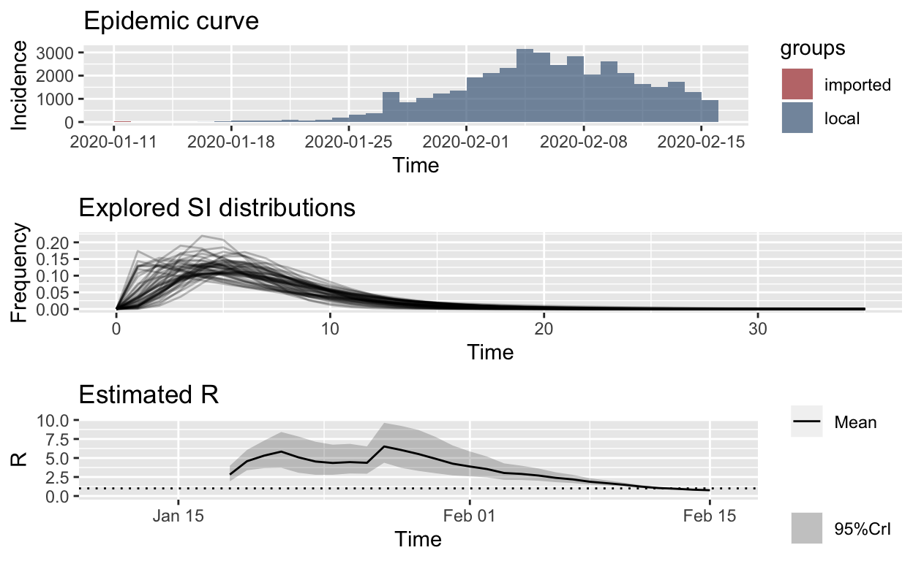

```{r setup, include=FALSE}
knitr::opts_chunk$set(echo = FALSE)
```

This post is just a pointer to [another post I authored for the _R Views_ blog](https://rviews.rstudio.com/2020/03/05/covid-19-epidemiology-with-r/). _R Views_ is published by [RStudio](https://rstudio.com), the public benefit corporation which develops and distributes the fabulous RStudio IDE (integrated development environment) for the [open-source `R` data analysis ecosystem](https://www.r-project.org), as well as sponsoring the development and maintenance of key [`tidyverse`](https://www.tidyverse.org) and related packages for `R` which greatly add to its capabilities.

The _R Views_ post is heavily based on material from two earlier posts on this site, but uses US COVID-19 incidence data to illustrate what additional information can be gleaned using cutting-edge analysis methods, even in the initial stage of an epidemic, as local transmission chains are just getting established.

It also serves as a _call-to-arms_ for epidemiologies, biostatisticians and data scientists: there are things you can do that can assist health authorities in their fight against this disease. Here is an excerpt from the post:

{width="90%"}

> You can clearly see the effect of the lock-down implemented in Hubei province and Wuhan city on or around 24th January, and the fact that the instantaneous $R_{e}$ started to fall a long time before the daily incidence of new cases reached its peak. Availability of such information helps government authorities to keep their nerve and to persist with unpopular public health measures, even in the face of rising incidence.

> It should only take a small team of data scientists a few days, using these and related tools, to construct ongoing reports or decision support tools, able to be updated continuously, or at least daily, to help support public health authorities in their (literally) life-and-death fight against COVID-19.

> But you need to start right away: epidemic behaviour is exponential.

The full post is [here](https://rviews.rstudio.com/2020/03/05/covid-19-epidemiology-with-r/).


